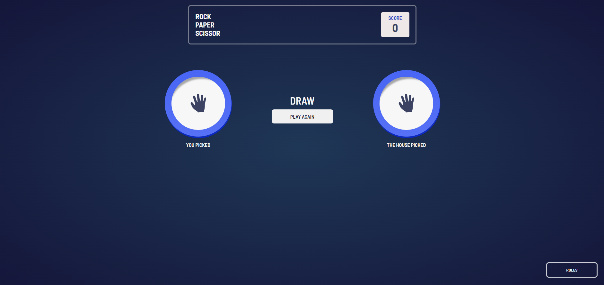
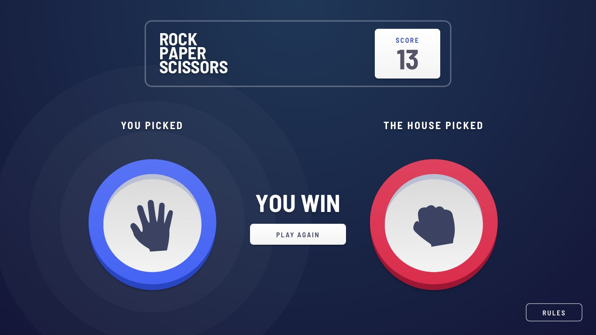

# Frontend Mentor - Rock, Paper & Scissor game

---

### Links

#####[Link to project Frontend Mentor](https://www.frontendmentor.io/challenges/rock-paper-scissors-game-pTgwgvgH)

<!-- prettier-ignore -->
#####[Link to my solution](https://holmar-rock-paper-scissor.netlify.app/)

---

### Screenshots of my solution

#### Desktop version

 

 

  

#### Mobiel version

 

 

---

### Screenshots of Frontend mentor's original solution

#### Desktop version

 

 

  

#### Mobiel version

 

 

---

#### What could be changed ?

- Use context instead of <b>prop-drilling</b>.
